# Dự án Backend PhimHay (Juanng)

Dự án **PhimHay (Juanng)** là hệ thống Backend phục vụ cho ứng dụng xem phim trực tuyến được phát triển trên nền tảng **Spring Boot** kết hợp cơ sở dữ liệu **PostgreSQL**. Dự án được xây dựng theo kiến trúc Modular Monolith thu nhỏ, đảm bảo tính mở rộng cao, bảo mật nghiêm ngặt và quản lý dữ liệu tối ưu.

---

## 🚀 Công nghệ Sử dụng (Tech Stack)

*   **Ngôn ngữ lập trình:** Java 21.
*   **Framework chính:** Spring Boot 4.0.6.
*   **Hệ quản trị cơ sở dữ liệu:** PostgreSQL.
*   **Giao tiếp Cơ sở Dữ liệu:** Spring Data JPA (Hibernate) với cơ chế tự động đồng bộ Schema (`ddl-auto: update`).
*   **Bảo mật & Phân quyền:** Spring Security & JWT (`jjwt` 0.11.5) hỗ trợ mã hóa mật khẩu `BCrypt` và cơ chế xoay vòng Refresh Token (Token Rotation).
*   **Quản lý Khóa Chính:** Sử dụng **ULID** (Universally Unique Lexicographically Sortable Identifier) thay cho UUID thông thường giúp cải thiện hiệu năng index cơ sở dữ liệu.
*   **Công cụ hỗ trợ:** Lombok, Spring Boot Actuator, Hibernate Validation, RestTemplate.

---

## 📁 Kiến trúc Mã nguồn (Project Directory Structure)

Dự án được cấu trúc rõ ràng thành các package chung (`common`) và các module nghiệp vụ cụ thể (`modules`):

```text
src/main/java/com/phimhay/juanng
├── JuanngApplication.java             # Lớp khởi chạy ứng dụng (Bootstrap & Load .env)
├── common                             # Các thành phần dùng chung hệ thống
│   ├── config                         # Cấu hình hệ thống (AppConfig, DataInitializer)
│   ├── exception                      # Quản lý ngoại lệ tập trung (AppException, GlobalExceptionHandler)
│   ├── response                       # Định dạng phản hồi API chuẩn (ApiResponse)
│   ├── security                       # Spring Security & JWT Filter
│   └── utils                          # Tiện ích chung (UlidHelper, SlugHelper)
└── modules                            # Các module nghiệp vụ chính
    ├── catalog                        # Phân hệ Danh mục (Phim, Thể loại, Quốc gia, Diễn viên, Đạo diễn, Crawler)
    │   ├── controller
    │   ├── dto
    │   ├── entity                     # Movie, Category, Country, Actor, Director, SyncSource
    │   ├── repository
    │   └── service                    # MovieCrawlerService, MovieSyncService
    ├── interaction                    # Phân hệ Tương tác (Yêu thích, Đánh giá, Lịch sử xem)
    │   └── entity                     # Favorite, Review, WatchHistory
    ├── streaming                      # Phân hệ Tập phim & Phụ đề
    │   ├── entity                     # Episode, Subtitle
    │   └── repository
    └── user                           # Phân hệ Quản lý Người dùng & Phân quyền
        ├── controller
        ├── dto
        ├── entity                     # User, Role, UserProfiles, RefreshToken, AccessLog
        ├── repository
        └── service
```

---

## 📊 Sơ đồ Thực thể Cơ sở Dữ liệu (ERD Diagram)

Mọi bản ghi dữ liệu (ngoại trừ các bảng liên kết phụ) đều sử dụng **ULID** làm khóa chính (chuỗi 26 ký tự) giúp sắp xếp theo thời gian tốt hơn UUID. Dưới đây là sơ đồ chi tiết các bảng và mối quan hệ:

```mermaid
erDiagram
    USERS {
        String id PK "ULID"
        String username "Tên đăng nhập"
        String password "Mật khẩu BCrypt"
        String email "Địa chỉ email (Unique)"
        boolean is_active "Trạng thái hoạt động"
        boolean is_email_verified "Đã xác thực email"
        boolean is_premium "Tài khoản VIP"
        LocalDateTime premium_expired_at "Hạn VIP"
        String provider "Nguồn đăng nhập (LOCAL, GOOGLE)"
        String provider_id "ID từ Provider xã hội"
    }
    USER_PROFILES {
        String id PK "ULID"
        String user_id FK "Liên kết USERS"
        String full_name "Họ và tên"
        String avatar_url "Link ảnh đại diện"
    }
    ROLE {
        Long id PK "Tự tăng"
        String role "Tên quyền (USER, ADMIN)"
    }
    REFRESH_TOKEN {
        Long id PK "Tự tăng"
        String user_id FK "Liên kết USERS"
        String token "Refresh Token"
        LocalDateTime expiry_date "Thời gian hết hạn"
        boolean revoked "Đã bị thu hồi"
    }
    ACCESS_LOG {
        String id PK "ULID"
        String user_id FK "Liên kết USERS"
        String ip_address "Địa chỉ IP"
        String user_agent "Thông tin trình duyệt"
        String endpoint "API đã truy cập"
    }
    
    MOVIES {
        String id PK "ULID"
        Long external_id "ID từ API nguồn"
        String name "Tên tiếng Việt"
        String origin_name "Tên gốc"
        String slug "Slug định dạng URL"
        String content "Nội dung tóm tắt"
        String type "Loại phim (series, single...)"
        String status "Trạng thái (completed, ongoing...)"
        String poster_url "Link ảnh bìa đứng"
        String thumb_url "Link ảnh bìa ngang"
        boolean is_copyright "Có bản quyền"
        String trailer_url "Link video trailer"
        String time "Thời lượng phim"
        String episode_current "Tập hiện tại"
        String episode_total "Tổng số tập"
        String quality "Chất lượng (HD, Full HD...)"
        String lang "Ngôn ngữ/Phụ đề"
        int year "Năm phát hành"
        int view "Lượt xem"
        boolean chieurap "Phim chiếu rạp"
        boolean sub_docquyen "Phụ đề độc quyền"
        boolean is_premium_only "Chỉ dành cho VIP"
        String tmdb_id "ID trên TMDB"
        String imdb_id "ID trên IMDB"
    }
    CATEGORIES {
        String id PK "ULID"
        String name "Tên thể loại"
        String slug "Slug thể loại"
    }
    COUNTRIES {
        String id PK "ULID"
        String name "Tên quốc gia"
        String slug "Slug quốc gia"
    }
    ACTORS {
        String id PK "ULID"
        String name "Tên diễn viên"
        String slug "Slug diễn viên"
    }
    DIRECTORS {
        String id PK "ULID"
        String name "Tên đạo diễn"
        String slug "Slug đạo diễn"
    }
    SYNC_SOURCES {
        Long id PK "Tự tăng"
        String name "Tên nguồn (VSMov, OPhim...)"
        String list_url_pattern "Mẫu API danh sách"
        String detail_url_base "Mẫu API chi tiết"
        boolean is_active "Đang kích hoạt"
        Integer last_synced_page "Trang cuối đã đồng bộ"
        LocalDateTime last_synced_at "Thời điểm đồng bộ cuối"
    }
    
    EPISODES {
        String id PK "ULID"
        String movie_id FK "Liên kết MOVIES"
        String server_name "Tên máy chủ (Vietsub, Thuyết minh)"
        String name "Tên tập"
        String slug "Slug tập"
        String filename "Tên tệp video"
        String link_embed "Đường dẫn nhúng iframe"
        String link_m3u8 "Đường dẫn video M3U8 trực tiếp"
    }
    SUBTITLES {
        String id PK "ULID"
        String episode_id FK "Liên kết EPISODES"
        String language_code "Mã ngôn ngữ (vi, en...)"
        String label "Nhãn hiển thị"
        String subtitle_url "Đường dẫn phụ đề"
    }

    FAVORITES {
        String id PK "ULID"
        String user_id FK "Liên kết USERS"
        String movie_id FK "Liên kết MOVIES"
    }
    REVIEWS {
        String id PK "ULID"
        String user_id FK "Liên kết USERS"
        String movie_id FK "Liên kết MOVIES"
        int rating "Điểm đánh giá (1-5)"
        String content "Nội dung bình luận"
    }
    WATCH_HISTORIES {
        String id PK "ULID"
        String user_id FK "Liên kết USERS"
        String episode_id FK "Liên kết EPISODES"
        int progress_seconds "Thời gian xem đã lưu (giây)"
        boolean is_completed "Đã xem hết"
    }

    USERS ||--|| USER_PROFILES : "chứa"
    USERS }o--o{ ROLE : "phân quyền"
    USERS ||--o{ REFRESH_TOKEN : "quản lý"
    USERS ||--o{ ACCESS_LOG : "ghi lại log"
    
    MOVIES }o--o{ CATEGORIES : "movie_categories"
    MOVIES }o--o{ COUNTRIES : "movie_countries"
    MOVIES }o--o{ ACTORS : "movie_actors"
    MOVIES }o--o{ DIRECTORS : "movie_directors"
    MOVIES ||--o{ EPISODES : "có các tập"
    
    EPISODES ||--o{ SUBTITLES : "có phụ đề"

    USERS ||--o{ FAVORITES : "yêu thích"
    MOVIES ||--o{ FAVORITES : "được thích bởi"
    USERS ||--o{ REVIEWS : "bình luận"
    MOVIES ||--o{ REVIEWS : "nhận bình luận từ"
    USERS ||--o{ WATCH_HISTORIES : "lịch sử xem"
    EPISODES ||--o{ WATCH_HISTORIES : "lưu tiến trình"
```



---

## 🛠️ Các Chức Năng Đã Triển Khai

### 1. Phân hệ Quản lý Người dùng & Bảo mật (`user` & `common/security`)
*   **Đăng ký & Đăng nhập:** Hệ thống mã hóa mật khẩu người dùng bằng `BCrypt`.
*   **Xác thực bằng Token JWT:**
    *   Tự động cấp phát cặp Access Token (ngắn hạn) và Refresh Token (dài hạn).
    *   Áp dụng cơ chế **Token Rotation (Xoay vòng Token)**: Mỗi lần yêu cầu Access Token mới bằng Refresh Token, Refresh Token cũ sẽ bị xóa bỏ ngay lập tức và cấp cặp token mới để tăng cường bảo mật.
*   **Quản lý người dùng của Admin:**
    *   Khóa/mở khóa tài khoản người dùng (`isActive = true/false`).
    *   Nâng cấp hoặc gia hạn gói VIP (Premium). Đặc biệt có **cơ chế cộng dồn ngày VIP** nếu người dùng vẫn đang còn hạn VIP cũ.
*   **Tự động Seed dữ liệu:** Tự động tạo các quyền mặc định (`USER`, `ADMIN`) và khởi tạo tài khoản quản trị tối cao (Admin) dựa trên cấu hình môi trường bảo mật.

### 2. Phân hệ Đồng bộ dữ liệu phim (`catalog` - Crawler)
*   **CRUD Nguồn phim (`SyncSource`)**: Quản lý cấu hình các nguồn phim một cách động trong database (ví dụ: KKPhim, OPhim, VSMov...). Quản trị viên dễ dàng CRUD nguồn mới mà không cần chỉnh sửa mã nguồn.
*   **Cào và đồng bộ phim thông minh (`MovieCrawlerService`)**:
    *   **Fetch Preview:** Lấy danh sách phim từ bên thứ ba về xem thử trên UI mà không lưu vào DB.
    *   **Crawl theo Trang:** Đồng bộ tự động toàn bộ phim thuộc trang được chọn từ API nguồn.
    *   **Crawl theo Slugs chọn lọc:** Chọn các phim cụ thể để tiến hành tải thông tin chi tiết và lưu trữ.
    *   **Chuẩn hóa dữ liệu:** Tự động chuẩn hóa diễn viên, đạo diễn từ tiếng Việt có dấu/ký tự đặc biệt thành dạng slug URL chuẩn.
    *   **Quản lý giao dịch an toàn (Transaction Isolation):** Tiến trình crawl chạy ngoài Transaction, mỗi phim đồng bộ chạy một transaction riêng biệt. Đảm bảo nếu một phim bị lỗi, các phim khác vẫn được cập nhật thành công và không khóa tài liệu DB lâu.

---

## ⚙️ Cấu Hình Môi Trường (`.env`)

Để bảo mật thông tin tài khoản admin và cấu hình ứng dụng không bị lộ trong mã nguồn, dự án sử dụng tệp `.env` tại thư mục gốc.

1. Hãy sao chép tệp mẫu cấu hình:
   ```bash
   cp .env.example .env
   ```

2. Hệ thống sẽ tự động liên kết các biến này vào `application.yaml` thông qua placeholder:
   ```yaml
   app:
     admin:
       email: ${ADMIN_EMAIL:nguyenluan@admin.com}
       password: ${ADMIN_PASSWORD:nguyenluan123}
   ```

---

## 🏃 Hướng Dẫn Khởi Chạy

### Yêu cầu hệ thống
*   **Java 21** cài đặt sẵn.
*   **PostgreSQL** chạy tại cổng `5432` với cơ sở dữ liệu tên là `movie_review`.

### Các bước thực hiện

1. **Khởi động cơ sở dữ liệu:** Hãy đảm bảo cơ sở dữ liệu PostgreSQL của bạn đang hoạt động và tài khoản đăng nhập khớp với cấu hình trong `src/main/resources/application.yaml`.
2. **Cấu hình file `.env`:** Tạo tệp `.env` như mục hướng dẫn ở trên.
3. **Chạy ứng dụng:**
   Sử dụng Maven Wrapper để khởi chạy Spring Boot:
   ```bash
   ./mvnw spring-boot:run
   ```
4. **Kiểm tra kết quả:**
   Khi hệ thống khởi chạy thành công, nó sẽ tự động chạy `DataInitializer` để tạo tài khoản admin và in nhật ký nạp thành công:
   ```text
   INFO --- [main] c.p.j.c.config.DataInitializer : Không tìm thấy tài khoản admin nguyenluan@admin.com, tiến hành tạo mới...
   INFO --- [main] c.p.j.c.config.DataInitializer : Tạo tài khoản admin thành công: nguyenluan@admin.com
   ```
5. **Chạy kiểm thử (Unit/Integration Tests):**
   ```bash
   ./mvnw test
   ```
